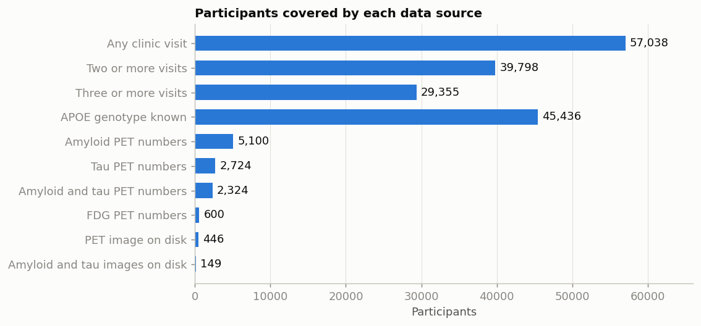
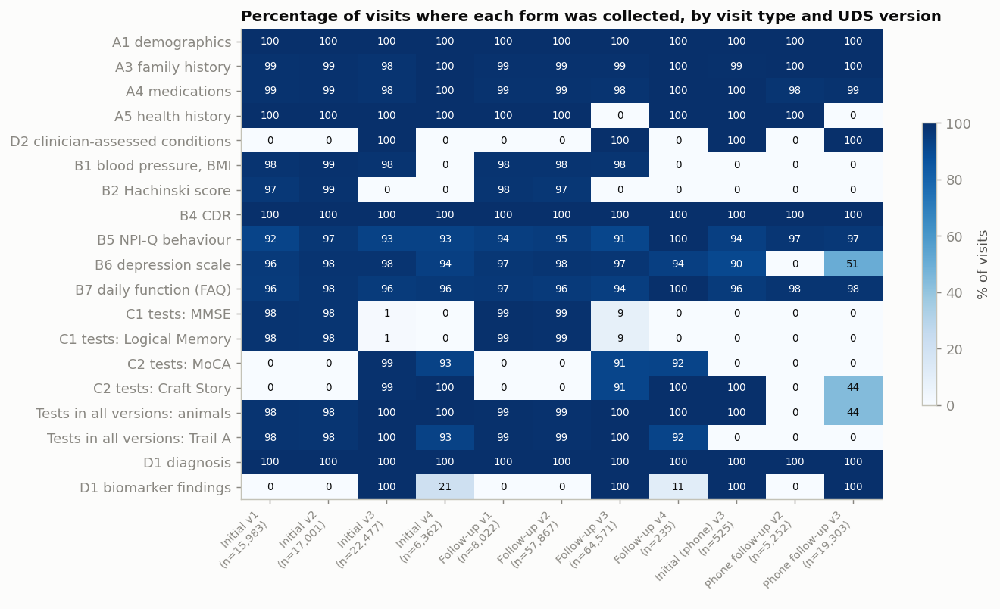
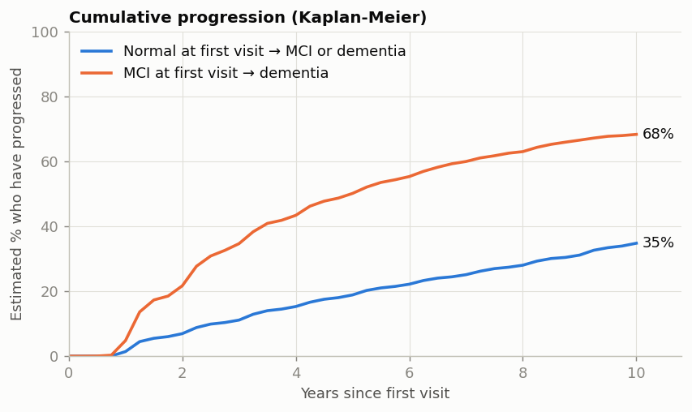
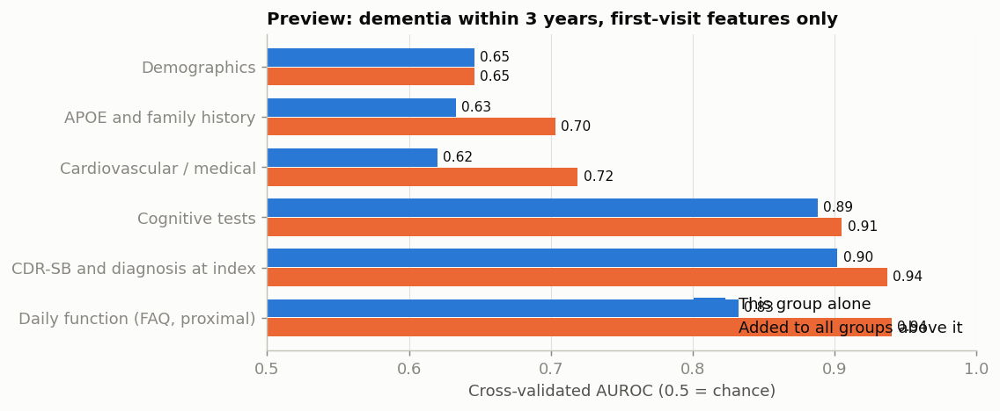
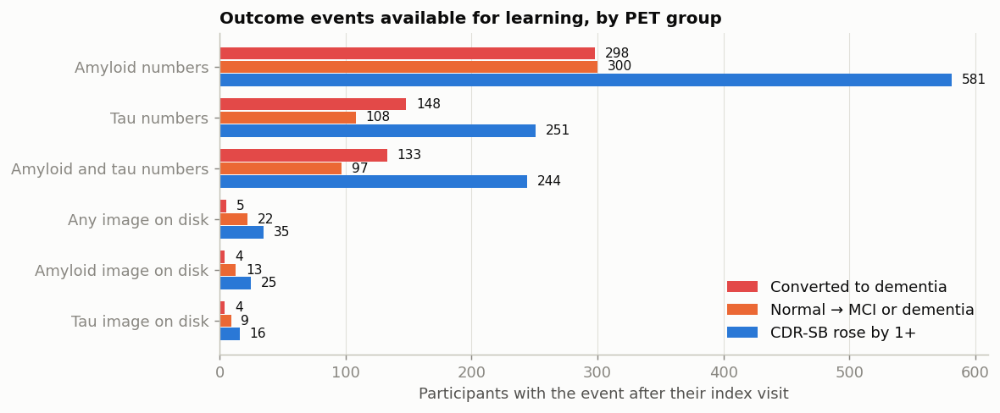
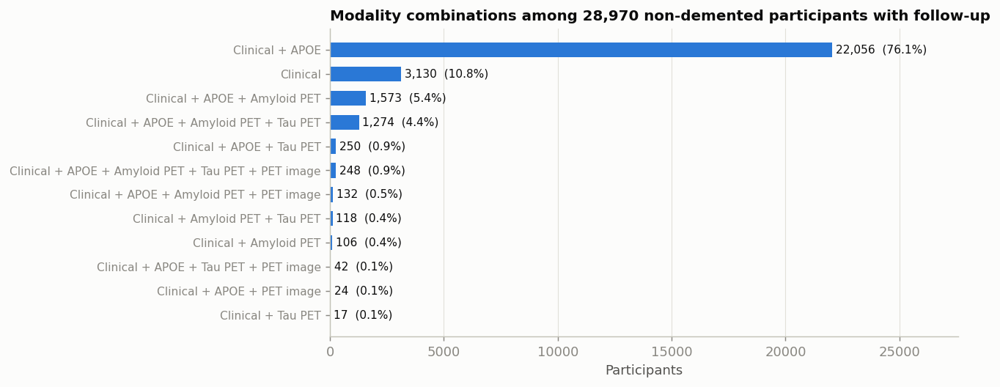

# Phase 1 summary: what the data can support

This is the short version of the four exploration notebooks in `notebooks/`. Every number here is an aggregate (a count, percentage or summary statistic). The notebooks explain how each one was produced and why it matters.

| Notebook | Question it answers |
|---|---|
| `01_data_catalogue.ipynb` | What is each file, what are its key variables, how many people and visits? |
| `02_longitudinal_and_outcomes.ipynb` | How are people followed over time, and what could we predict? |
| `03_feature_categories.ipynb` | What do demographics, APOE, cardiovascular and cognitive data look like and contribute? |
| `04_pet.ipynb` | What PET data exist, and what is realistic to do with them? |

Supporting files: `reports/variable_map.md` (every variable we plan to use, with meaning, codes, missing codes and coverage), `reports/data_audit_summary.md` (file-level audit), `reports/figures/` (all figures).

## 1. The files

| Source | Rows | Participants | What it is |
|---|---|---|---|
| Main clinical table (`ftldlbd`) | 217,598 visits | 57,038 | UDS forms: demographics, history, blood pressure, medications, cognitive tests, CDR, diagnosis, APOE. 2,649 columns, of which 787 have data in at least 10% of visits |
| SCAN amyloid PET (summary + regional) | 3,933 scans | 3,566 | Centiloids, amyloid status, SUVR by region |
| Mixed-protocol amyloid PET | 2,235 scans | 2,073 | Older scans, reprocessed centrally |
| SCAN tau PET | 2,653 scans | 2,405 | Meta-temporal and regional SUVR |
| Mixed-protocol tau PET | 671 scans | 616 | Older tau scans |
| SCAN FDG PET | 885 scans | 639 | Meta-ROI and regional SUVR |
| SCAN PET QC | 8,759 images | 4,585 | Image list with tracer, scanner, pass/fail |
| CLARiTI EDC | 857 rows | 776 | Study tracking dates; not a feature source |
| PET images on disk | 599 scans | 446 | Raw dynamic DICOM: 318 amyloid, 232 tau, 49 FDG |

Linked to the clinical table: 5,100 participants with amyloid PET numbers, 2,724 with tau, 600 with FDG, 446 with an image.

## 2. Longitudinal structure

* 39,798 participants (70%) have two or more visits; 29,355 have three or more.
* Among those with follow-up, the median span is 3.5 years (middle half 2.0 to 6.9).
* Visits are roughly yearly (median gap 12.7 months) but irregular (10 to 26 months covers 90% of gaps).
* Data run from 2005 to 2026 across four UDS versions. The cognitive battery changed at version 3 (2015).

## 3. Outcomes

CDR, CDR-SB and clinical diagnosis are recorded at every visit in every version, which makes them the safest targets.

* Diagnosis at first visit: 41.9% normal, 4.6% impaired-not-MCI, 22.5% MCI, 31.0% dementia.
* Kaplan-Meier progression: roughly one in three people with MCI reach dementia within 3 years; about one in ten people who start normal reach MCI or dementia within 3 years.
* With a 3-year horizon and people not demented at first visit, 19,611 have a known status and 2,833 (14.4%) converted to dementia. The rate is 1.6% from normal and 41.4% from MCI.
* CDR-SB change is heavily concentrated at zero: 72% show no worsening at 3 years, 18.5% rise by one point or more.

## 4. What each category can contribute

| Category | Coverage | Main cleaning issue | Expected contribution |
|---|---|---|---|
| Demographics | ~100% | Little | Strong (age); confounders for everything else |
| APOE | 79.7% genotyped; 40.6% of those carry e4 | Not-genotyped is not random | Clear, established signal |
| Cardiovascular / medical | History ~99% at first visit but ~60% of all visits; blood pressure 87% of first visits; medication flags ~98% of all visits | Same condition on two forms (A5, D2); must be merged and carried forward | Modest added value; this is the research question |
| Cognitive tests | 40-95% depending on version | Battery changed at version 3; "could not complete" is informative | Dominant |
| Function (FAQ), independence | ~90% | Very close to the diagnosis itself | Large but partly circular |
| PET numbers | 5,100 amyloid, 2,724 tau | Tracer differences; scan-to-visit matching | Plausibly useful, especially in cognitively normal people |
| PET images | 446 | Raw, dynamic, about 20 scanner models, no MRI | Cannot support a decline-prediction model |

A first-visit preview (logistic regression, 5-fold cross-validation, placeholder target of dementia within 3 years) gives a sense of scale. It is a preview of the method, not a result.

| Feature group | AUROC alone | AUROC when added to the groups above |
|---|---|---|
| Demographics | 0.65 | 0.65 |
| APOE and family history | 0.63 | 0.70 |
| Cardiovascular / medical | 0.62 | 0.72 |
| Cognitive tests | 0.89 | 0.91 |
| CDR-SB and diagnosis at index | 0.90 | 0.94 |
| Daily function (FAQ) | 0.83 | 0.94 |

Cardiovascular features add about 0.02 AUROC over demographics and APOE in this rough look, and cognition dominates. Expect the proper experiment to show a modest cardiovascular contribution. That is a legitimate answer to the research question and should be reported as it comes out.

## 5. PET: the finding that shapes the design

| PET group | Not demented at index, with follow-up | Converted to dementia | Normal to MCI or dementia | CDR-SB rose by 1+ |
|---|---|---|---|---|
| Amyloid numbers | 2,752 | 298 | 300 | 581 |
| Tau numbers | 1,439 | 148 | 108 | 251 |
| Amyloid and tau numbers | 1,273 | 133 | 97 | 244 |
| Any image on disk | 311 | 5 | 22 | 35 |

* The PET **tables** have enough people and events for a tabular PET model and an honest test of whether PET adds to clinical data.
* The PET **images** do not. Of the 446 people with an image, about 86% were cognitively normal at the scan, follow-up after the scan is about 2 years, and only 5 converted to dementia. No image architecture can learn decline from that.
* The images can still be used for three honest things: reproducing the PET core's SUVR from raw images, training an image model for amyloid positive versus negative (208 negative and 84 positive labelled amyloid images), and an exploratory embedding in the fusion model.
* 76% of the non-demented participants with follow-up have clinical data and APOE but no PET. A fusion model has to work when PET is missing.

## 6. Limits to state in the report

1. NACC is a volunteer and memory-clinic cohort: highly educated (median 16 years), 76% White, enrolled at a median age of 71. Results describe people like these.
2. People with dementia at enrolment return less often (61% versus 77% of normal participants), so any cohort that requires follow-up is healthier than everyone enrolled.
3. Cardiovascular exposure in mid-life, which matters most for dementia risk, is not observed.
4. Associations are not causes. Low BMI going with more conversion is an example of the disease changing the "risk factor".
5. The preview numbers above use first-visit data only and no held-out test set.

## 7. Decisions the team needs to make

These are collected in `docs/project_plan.md` with a suggested default for each.
