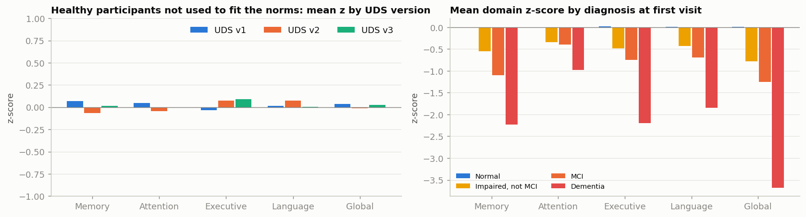
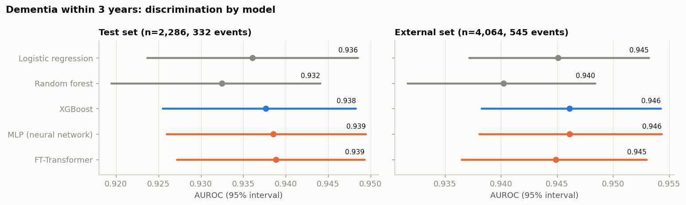
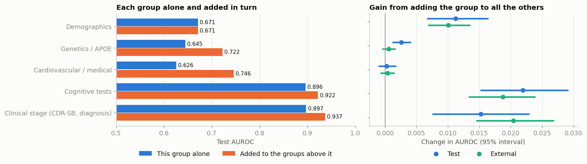
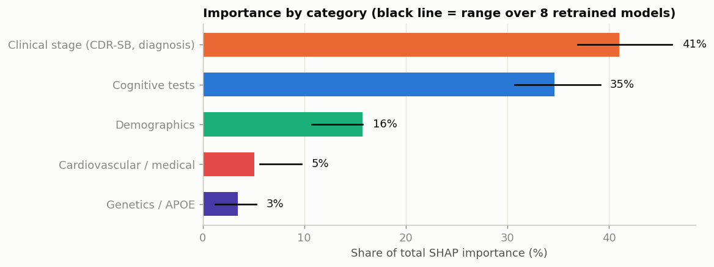

# Phases 2, 3 and 7: cleaning, models and explanations

Short version of notebooks `05`, `06` and `07`. All figures are aggregates. Every result is from participants the models never trained on.

## How to reproduce

```
python scripts/build_dataset.py       # raw files -> data/processed (cleaning, cohort, labels, splits)
python scripts/train_tabular.py       # five models + feature-group experiment
python scripts/train_longitudinal.py  # trajectory features and GRU
python scripts/explain.py             # SHAP
```

Then open notebooks 05 to 07, which read the saved results.

## Choices made (defaults; change the constants in `build_dataset.py` and re-run)

| Choice | Value |
|---|---|
| Cohort | Not demented at the index visit; in-person visit; UDS versions 1-3 |
| Main target | Dementia diagnosis within 3 years |
| Unknown outcome | Excluded from the label and counted (about half of those eligible) |
| Test sets | 15% of participants (internal test) and 9 of 46 centres held out entirely (external) |
| Cognitive tests | z-scores against cognitively normal training participants, adjusted for age, sex, education; averaged into domains |
| Medical history | "Ever" flags from form A5 or D2, carried forward |
| Close-to-diagnosis variables | Left out of the main model; effect reported separately |

## Cohort

| | Train | Validation | Test | External centres |
|---|---|---|---|---|
| First-visit cohort, participants (converted within 3 years) | 10,879 (1,599) | 2,241 (342) | 2,286 (332) | 4,064 (545) |
| Longitudinal landmarks (events) | 23,025 (2,016) | 4,661 (385) | 1,205 (166) | 2,254 (326) |

The cognitive harmonisation was checked on healthy participants the norms never saw: mean domain z-scores stay within 0.1 of zero in every UDS version.



## Result 1: model type makes no difference

Dementia within 3 years, 48 first-visit features. AUROC with 95% bootstrap interval.

| Model | Test AUROC | Test AUPRC | External AUROC |
|---|---|---|---|
| Logistic regression | 0.936 (0.924-0.949) | 0.720 | 0.945 (0.937-0.953) |
| Random forest | 0.932 (0.919-0.944) | 0.704 | 0.940 (0.932-0.948) |
| XGBoost | 0.938 (0.926-0.948) | 0.711 | 0.946 (0.938-0.954) |
| MLP (neural network) | 0.939 (0.926-0.949) | 0.721 | 0.946 (0.938-0.954) |
| FT-Transformer | 0.939 (0.927-0.949) | 0.722 | 0.945 (0.937-0.953) |



The deep models match gradient boosting and logistic regression; none is measurably better. The headline AUROC is inflated by mixing normal and MCI participants. Within people who had MCI at the index visit it is about 0.84; within those who were normal it is about 0.84 to 0.89 with a wide interval (24 converters in the test set).

Predicted risks are well calibrated on the test set and slightly high on the external centres (Brier 0.067 against 0.124 for always predicting the base rate).

## Result 2: cardiovascular features do not add predictive value once cognition is known

Gain in AUROC from adding each group to a model that already has all the others (XGBoost, paired bootstrap):

| Group | Test gain (95% interval) | External gain (95% interval) |
|---|---|---|
| Cognitive tests | +0.022 (+0.015 to +0.029) | +0.019 (+0.013 to +0.024) |
| Clinical stage (CDR-SB, diagnosis) | +0.015 (+0.008 to +0.023) | +0.020 (+0.015 to +0.027) |
| Demographics | +0.011 (+0.007 to +0.016) | +0.010 (+0.007 to +0.014) |
| Genetics / APOE | +0.003 (+0.001 to +0.004) | +0.001 (-0.000 to +0.002) |
| Cardiovascular / medical | +0.0002 (-0.001 to +0.002) | +0.0004 (-0.001 to +0.001) |



Added to demographics and APOE only (before any cognitive data), the cardiovascular group gains +0.024 on the test set but +0.003 on the external centres, where the interval includes zero.

Stated carefully: in NACC, once current cognition is known, late-life cardiovascular and medical records did not improve 3-year prediction of dementia. Mid-life exposure is not observed in this cohort, so this is not evidence that vascular health is unrelated to dementia.

## Result 3: history adds very little

| Model | Test AUROC | Gain vs no history | External AUROC | Gain vs no history |
|---|---|---|---|---|
| XGBoost, landmark visit only | 0.920 | reference | 0.952 | reference |
| XGBoost + trajectory features | 0.923 | +0.003 (-0.006 to +0.011) | 0.956 | +0.003 (-0.000 to +0.007) |
| GRU over the visit sequence | 0.920 | -0.000 (-0.011 to +0.009) | 0.958 | +0.005 (+0.001 to +0.009) |

The current visit already reflects past decline, so the slope adds little. A recurrent network is not needed for accuracy here.

## Result 4: what the model relies on (SHAP)

| Category | Share of importance | Range over 8 retrained models |
|---|---|---|
| Clinical stage (CDR-SB, diagnosis) | 41% | 37-46% |
| Cognitive tests | 35% | 31-39% |
| Demographics (mostly age) | 16% | 11-16% |
| Cardiovascular / medical | 5% (main model) | 6-10% |
| Genetics / APOE | 4% | 1-5% |



Category-level importance is stable. The order of individual mid-ranked features is not (age moves between 4th and 8th), so only category-level statements belong in the report. Directions are clinically sensible. Race appears in the top 15 and needs a subgroup check in validation.

## Limits

* Retrospective results on research volunteers. Not clinical validation.
* Light tuning only.
* People with unknown 3-year status are excluded; a survival analysis will check the effect.
* Few converters among cognitively normal participants in the test set.

## Next

PET numbers (does PET add to the clinical model?), PET image pipeline, fusion with missing modalities, full validation, interface, and the evidence assistant.
